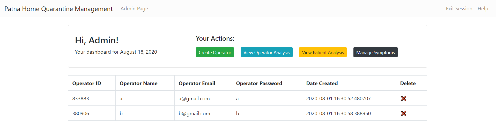
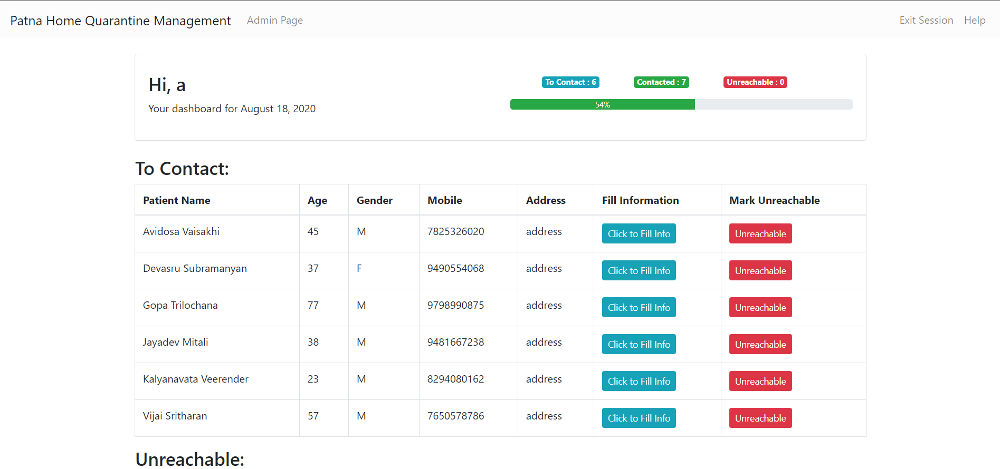
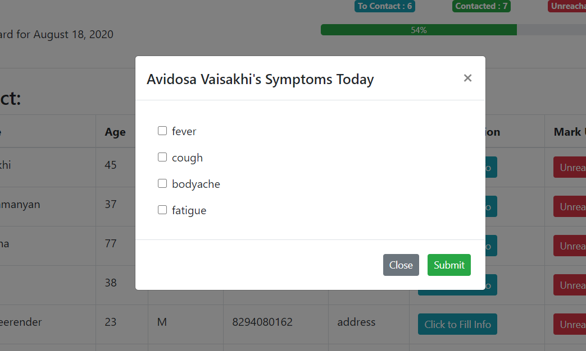

# Home Quarantine Management System

A system to manage the daily updation of patient health and current symptoms via call operators for those in home isolation. This system has the following features:
- secure admin login
- secure operator login -- for multiple phone operators
- admin features
    - create/delete operator
    - create/delete symptop
    - operator performance visualization
- operator dashboard with daily tasks
- automated patient allocation
- automated backend integration with Google Sheet

Although this system was designed on an urgent basis for COVID relief, the application can also be used for call-center target allocation and other similar usecases.

Released under the MIT License. (C) Vivek Kaushal 2020.
